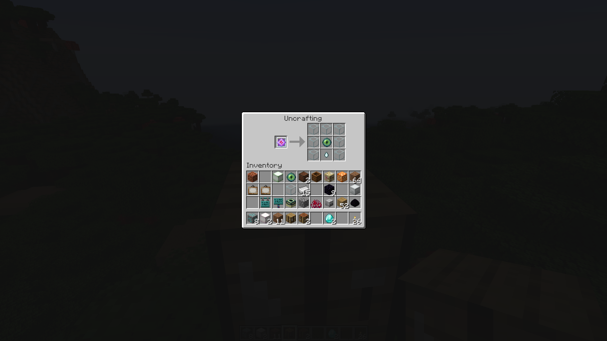
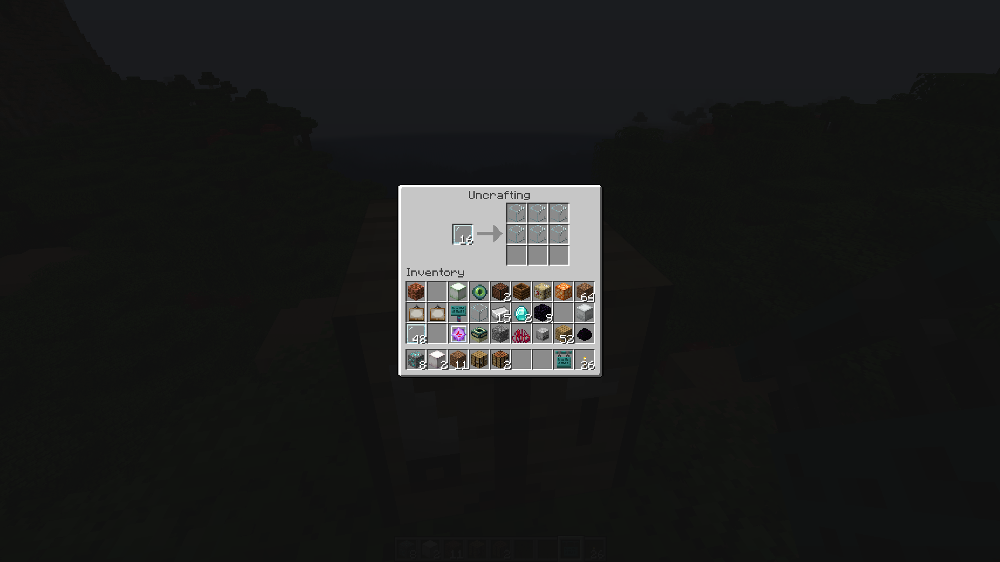
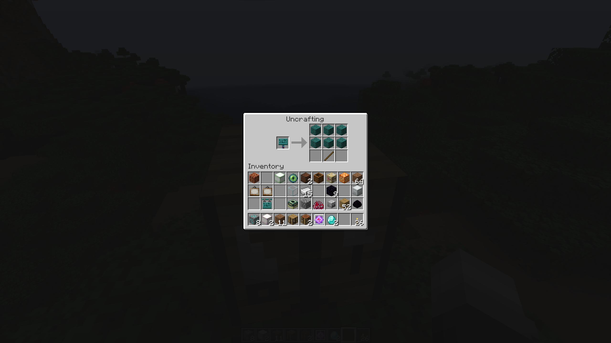

# Table of Uncrafting

This mod adds a 'Uncrafting Table' allowing you to uncraft your Items!

Every item is supported, even **Mod-Items** from any other mod!

## Installing
Download it from [GitHub Releases](https://github.com/1TheCrazy/TableOfUncrafting/releases), [Modrinth](https://modrinth.com/mod/table-of-uncrafting) or [CurseForge](https://curseforge.com/minecraft/mc-mods/table-of-uncrafting)

Then place it inside your `mods` folder for Minecraft.

Make sure you have Fabric installed!

## Dependencies
This mod depends on the **Fabric-API**

## Screenshots

